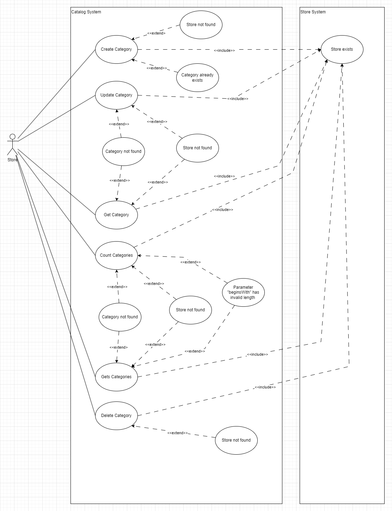
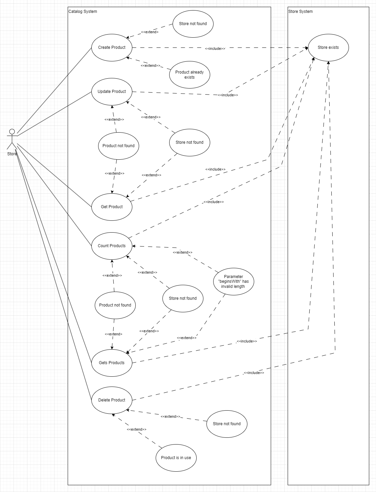
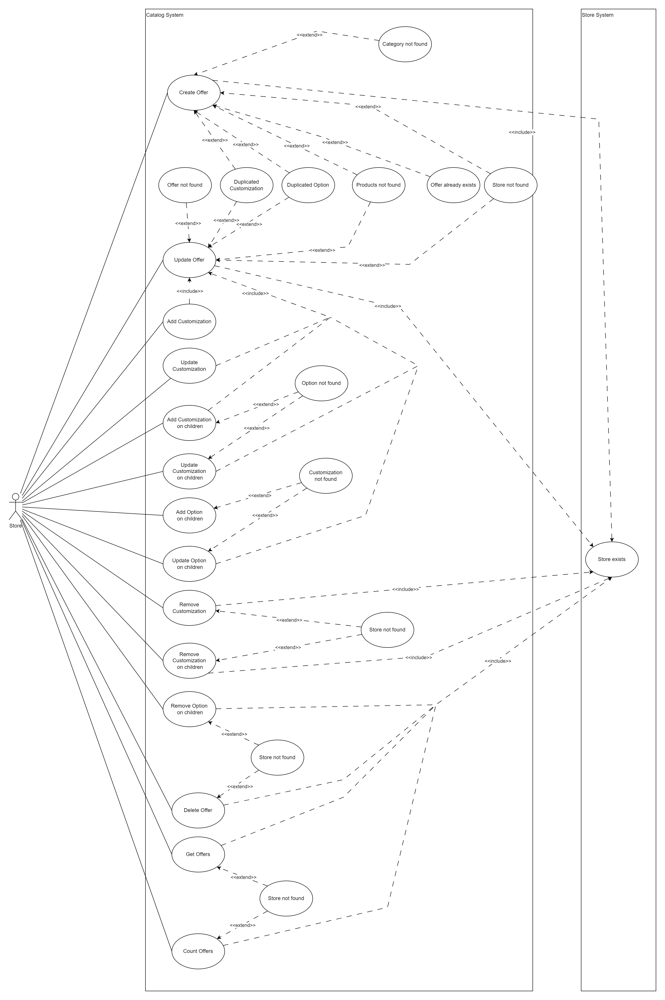
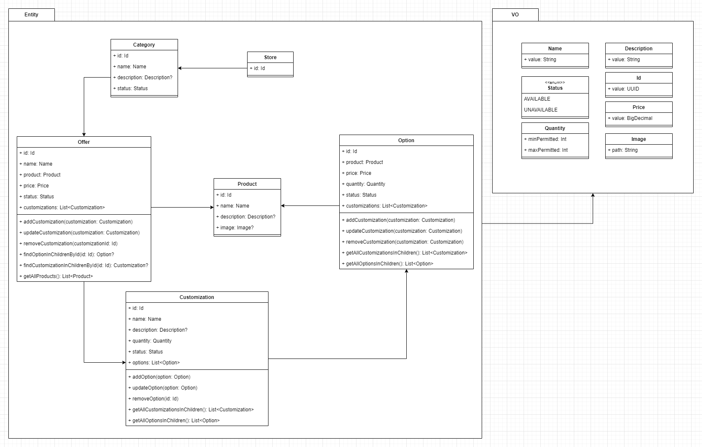
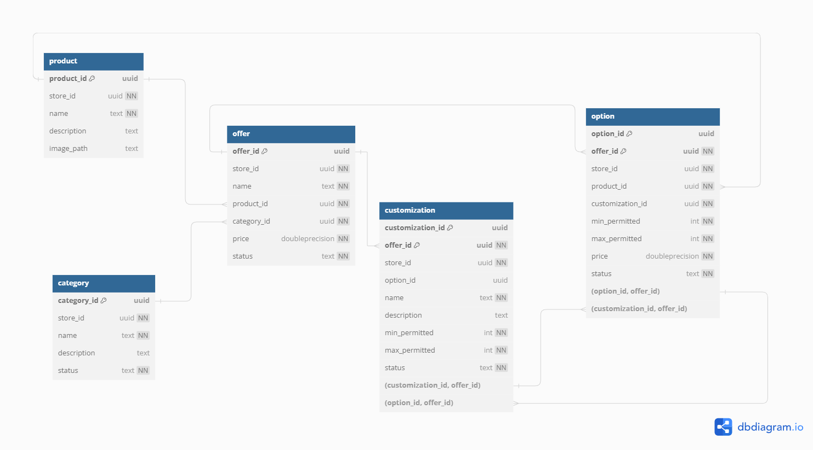
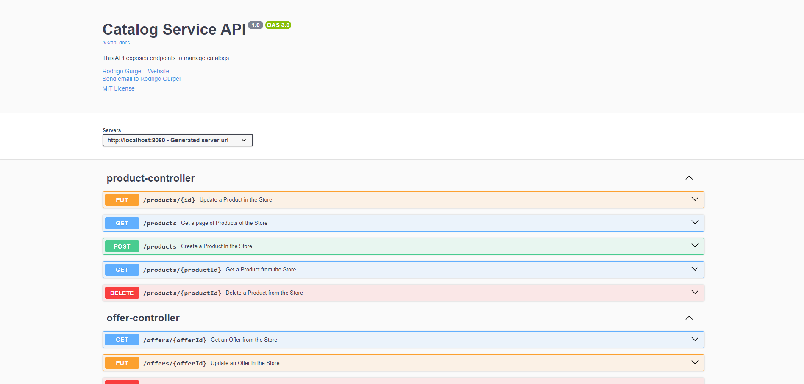

# Sobre o Domínio

Um catálogo de produtos deve oferecer aos usuários uma ampla gama de operações. Ele deve suportar desde cenários
simples, como criar um produto e uma oferta de venda, até cenários complexos, como definir várias customizações em
diferentes níveis para uma oferta de venda.

## Definindo os Casos de Uso

Definir os casos de uso requer uma compreensão profunda dos comportamentos do usuário no mundo real.

Para facilitar a visualização, os casos de uso foram divididos por contexto:

- Caso de uso da Categoria
- Caso de uso do Produto
- Caso de uso da Oferta

Os casos de uso considerados envolvem usuários que já possuem uma loja, permitindo a implementação de outro sistema para
gerenciar as lojas.

### Caso de uso da Categoria

As ações de um usuário com uma Categoria incluem:

### Caso de uso do Produto

As ações de um usuário com um Produto incluem:

### Caso de uso da Oferta

A Oferta é a entidade principal que agrega Customizações, Opções e a própria Oferta, significando que todas as ações nas
entidades filhas devem passar por ela.

As ações de um usuário com uma Oferta incluem:

## Definindo as Entidades e Relacionamentos

Durante a definição dos casos de uso, algumas entidades foram identificadas, assim como seus relacionamentos.

Foram também definidas regras de negócio que destacam o forte relacionamento entre uma Oferta e suas Customizações e
Opções. Assim, a Oferta foi definida como a entidade principal, com Customizações e Opções como entidades subordinadas.

Algumas regras de propriedades das entidades foram definidas, exigindo a criação de Objetos de Valor reutilizáveis que
protejam as regras de negócio.

## Mapeando as Entidades para o Banco de Dados

Após o início do desenvolvimento do projeto e a escolha do banco de dados, foi necessário mapear as entidades para
tabelas do banco de dados.

O banco de dados escolhido foi o PostgreSQL, mas também foi implementado um banco de dados não relacional (DynamoDB)
para fins de teste.

## Mapeando a API

A interface escolhida para o sistema foi uma API REST, por ser facilmente implementada em aplicações web e mobile.

A API foi documentada usando o Swagger UI e está disponível para consulta no endpoint padrão do Swagger na aplicação.

